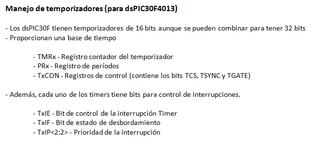
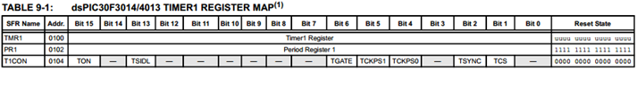

.. -*- coding: utf-8 -*-

.. _rcs_subversion:

Clase 04 - PIII 2015 - 02-08-2015
=================================

.. figure:: images/clase04/map_timer23.png

.. figure:: images/clase04/map_timer45.png

.. figure:: images/clase04/ejemplo.png

.. code-block::

	void detectarIntT1() org 0x001a  {
		LATBbits.LATB0 = !LATBbits.LATB0;
		IFS0bits.T1IF=0;  // Borramos la bandera de interrupción T1
	}

	void main(){
		TRISBbits.TRISB0 = 0;
		LATBbits.LATB0 = 0;

		// Modo de operación Timer1
		T1CON=0x0000;

		// Modo operación Timer1: reloj interno, escala 1:1, empieza cuenta en 0
		TMR1=0;

		// Cuenta 500 ciclos
		PR1=500;

		// Interrupciones Timer1, borra Bandera de interrupción
		IFS0bits.T1IF=0;

		// Habilita interrupción
		IEC0bits.T1IE=1;

		// Arranca Timer1
		T1CONbits.TON=1;

		while(1)
			asm nop;
	}

