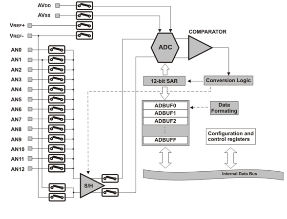

.. -*- coding: utf-8 -*-

.. _rcs_subversion:

Clase 04 - PIII 2015
====================

.. figure:: images/clase04/manejo_timers.png

.. figure:: images/clase04/map_timer1.png
   :target: http://ww1.microchip.com/downloads/en/devicedoc/70138c.pdf

.. figure:: images/clase04/map_timer23.png
   :target: http://ww1.microchip.com/downloads/en/devicedoc/70138c.pdf

.. figure:: images/clase04/map_timer45.png
   :target: http://ww1.microchip.com/downloads/en/devicedoc/70138c.pdf

.. figure:: images/clase04/ejemplo.png

.. code-block::

	void detectarIntT1() org 0x001a  {
	    LATBbits.LATB0 = !LATBbits.LATB0;
	    IFS0bits.T1IF=0;  // Borramos la bandera de interrupción T1
	}

	void main()  {
	    TRISBbits.TRISB0 = 0;
	    LATBbits.LATB0 = 0;

	    // Modo de operación Timer1
	    T1CON=0x0000;

	    // Modo operación Timer1: reloj interno, escala 1:1, empieza cuenta en 0
	    TMR1=0;

	    // Cuenta 500 ciclos
	    PR1=500;

	    // Interrupciones Timer1, borra Bandera de interrupción
	    IFS0bits.T1IF=0;

	    // Habilita interrupción
	    IEC0bits.T1IE=1;

	    // Arranca Timer1
	    T1CONbits.TON=1;

	    while(1)
	       asm nop;
	}

Conversor AD
============	

- Lleva a cabo la digitalización de las señales analógicas externas. 
- En la familia dsPIC30F hay dos versiones: 10 bits y 12 bits.
- Hay dos entradas analógicas para establecer una tensión de referencia externa: AVDD y AVSS (Vref+ y Vref-)
- Para controlar el ADC se usan 6 registros de control de 16 bits: 
	- ADCON1
	- ADCON2
	- ADCON3 sirve para seleccionar el modo del ADC
	- ADCHS para seleccionar las entradas analógicas
	- ADPCFG para seleccionar el pin utilizado como entrada analógica y el pin usado como pin de I/O
	- ADCSSL para seleccionar las entradas analógicas que serán escaneadas

- La conversión se guarda en un buffer de sólo lectura ADBUF0 a ADBUFF (16 palabras de 12 bits)

**Conversor AD de 12 bits**

**Una secuencia de conversión**

- El proceso de adquisición de muestras se inicia activando el bit SAMP (este bit está en ADCON1)
- La conversión se puede iniciar por: bits de control programable, contador de tiempo o un evento externo
- Cuando el tiempo de conversión es completa, el resultado se carga en la buffer ADBUF0 a ADBUFF. 
- Al término de la conversión, el bit DONE (está en ADCON1) y la bandera de interrupción se setean luego del número de muestras definidas por los bits de control SMPI (este bit está en ADCON2)

**Pasos para realizar una conversión AD:**

	- Configurar el módulo AD
		- Configurar los pines como entradas analógicas, referencias de voltaje, y los pines digitales de I/O
		- Seleccionar un canal de entrada del convertidor AD
		- Seleccionar un reloj de conversión AD
		- Seleccionar una fuente de trigger (disparo)
		- Activar el módulo AD

	- Iniciar el muestreo
	- Esperar el tiempo de adquisición de muestras
	- Fin de adquisición, inicia la conversión
	- Esperar que se complete la conversión con el bit DONE
	- Leer el buffer
	
	

