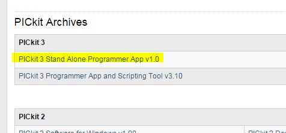
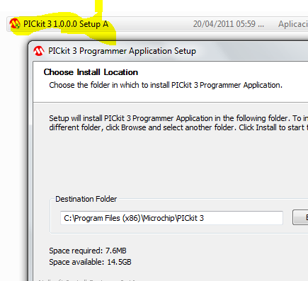
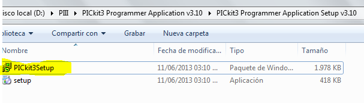
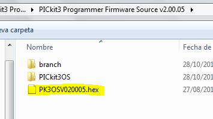
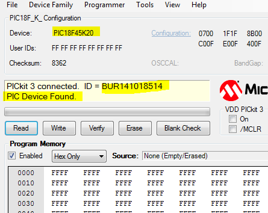

.. -*- coding: utf-8 -*-

.. _rcs_subversion:

Clase 10 - PIII 2015
====================

**Grabación de dsPIC con Pickit 3**

- Descargamos aplicativo desde: http://www.microchip.com/pagehandler/en-us/devtools/dev-tools-parts.html

- Instalamos el aplicativo:

- Conectar el Pickit 3 a la PC y esperar que instale controladores (la instalación del aplicativo instala los controladores también).

- Como hubo problemas para hacerlo funcionar. Instalamos también:

- Para abrirlo ejecutamos:

.. figure:: images/clase10/im4.png

- Este sí funciona, pero requiere instalar un Firmware distinto al PicKit 3. El firmware que se cargó en el PicKit fue:

- Podemos probar conectando la Demo board que viene con el PicKit 3 ( más info en: http://ww1.microchip.com/downloads/en/DeviceDoc/41296B.pdf )

- Le damos a Check Comunication y nos detecta la Demo Board conectada:

- Si conectamos el circuito de grabación del dsPIC30F3010, también lo detecta:

.. figure:: images/clase10/im7.png

- Hacer un Hola Mundo en mikroC simplemente para hacer parpadear un led. Escribir el programa en mikroC, compilar para generar el hex, grabarlo con el PicKit 3 y por último probarlo en la placa.

- Se puede leer el dsPIC y grabar el firmware en un .hex y también se puede escribir nuestro .hex creado con mikroC.

- Abrir mikroC para PIC ( no dsPIC ), crear un proyecto para PIC18F45K20 y grabarlo.

- Video sobre cómo utilizar el generador de señal (https://www.youtube.com/watch?v=qCRcNYbqBxs)

